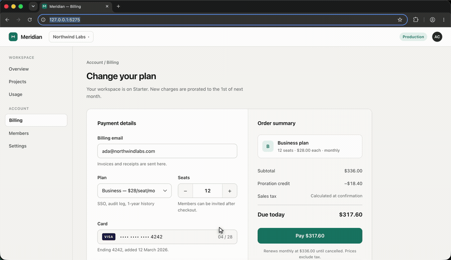
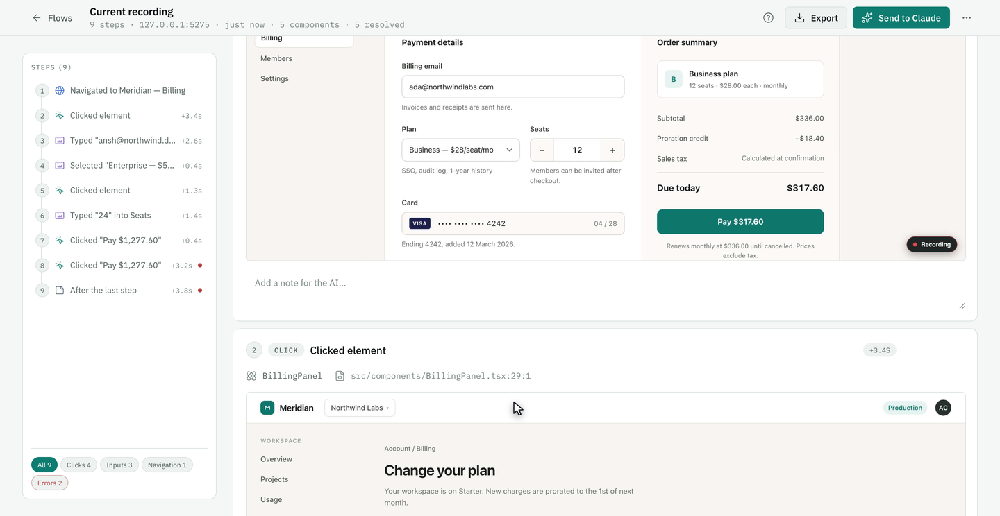
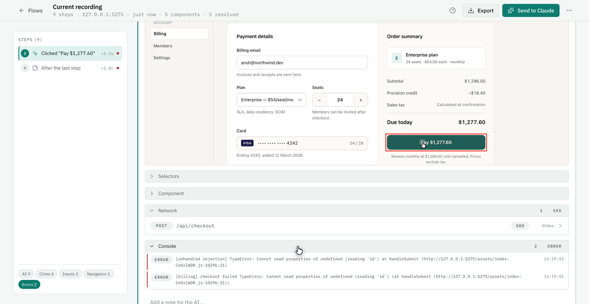
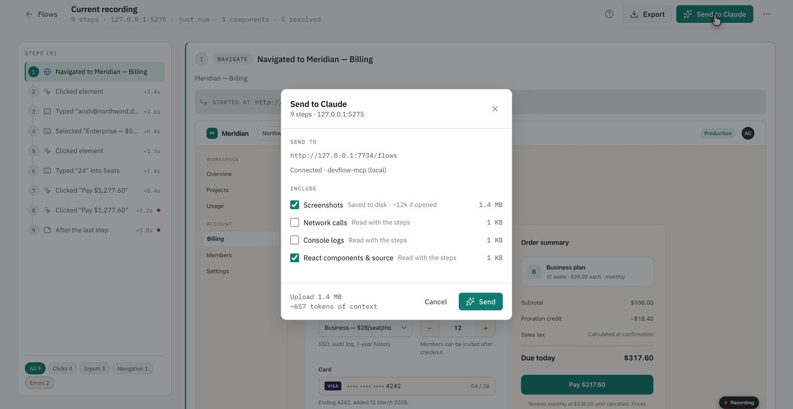
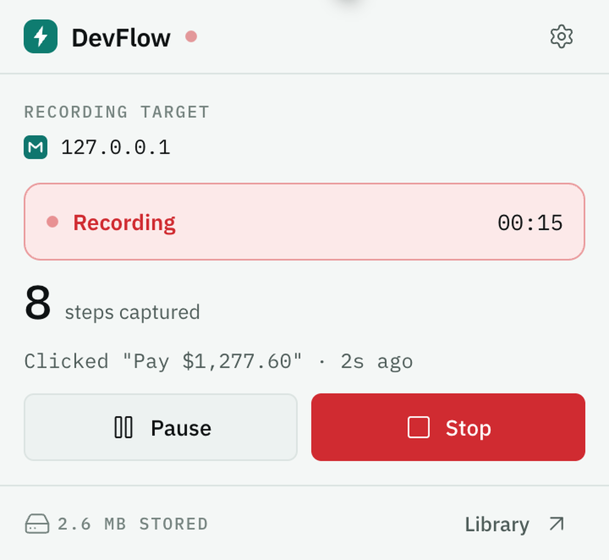
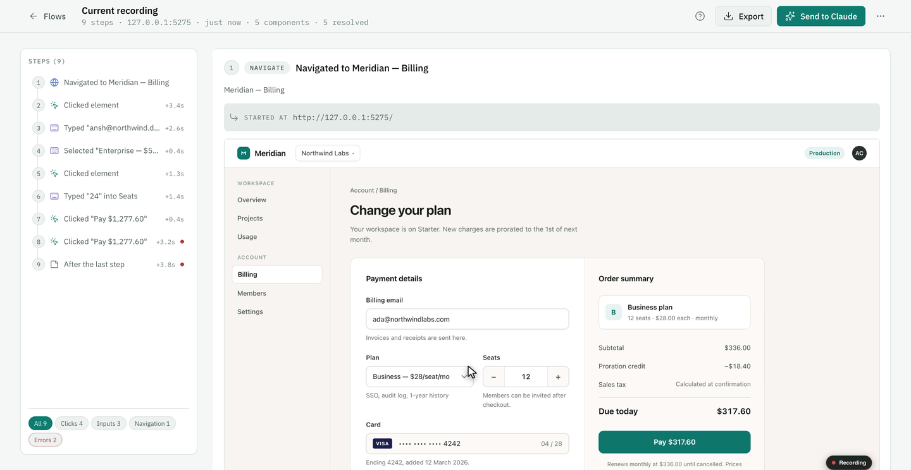

<div align="center">

# DevFlow

**Record what your app actually did in the browser, and hand it to Claude Code.**

Every step carries the component that rendered it, resolved through your own
source maps to a real file and line — even on a minified production build.

<br>



</div>

---

You build by describing what you want and letting an AI write it. That works
until something breaks — and then you have to describe the break, which means
guessing which part went wrong. You are usually wrong. Everyone is.

DevFlow removes the guessing. Press record, use your app until the bug happens,
press send. Claude Code gets the clicks, the failed requests with their real
response bodies, the error messages, a screenshot of every step, and the source
file behind each one.

**A recording is not an opinion.**

---

## What it looks like

A recorded step, attributed to the component that rendered it and resolved
through the page's own source maps — from a **minified production bundle** back
to `src/components/BillingPanel.tsx:29`.



The cause and the symptom, on one screen. The server answered `POST
/api/checkout` with a **500** in 454 ms; the page's unguarded success path then
threw a `TypeError` the user never saw. A screenshot shows only the second one.



Then hand it over. **Send to Claude** posts the recording to a local server and
puts a prompt on your clipboard — Claude opens the right files immediately,
because the component sources travelled with the flow.



---

## Four words, first

DevFlow uses these four precisely and never interchangeably. Everything below
depends on them, and they take ten seconds to learn.

| | |
| --- | --- |
| **flow** | One recording, start to stop. Press record, use your app, press stop — that's a flow. |
| **step** | One thing you did inside a flow. A click, something typed, a page change. |
| **element** | A thing on the page. The actual button you clicked. |
| **component** | The piece of code that drew that button. This is what DevFlow traces back to your source file. |

---

## Setting it up

Two halves: a Chrome extension that records, and a small local server that hands
recordings to Claude Code. About ten minutes, once.

**Before you start** you need Chrome 116 or newer and Node 20.11 or newer. To
check Node, open a terminal and run `node --version`. If it prints something
lower, or "command not found", install Node from [nodejs.org](https://nodejs.org)
first.

### 1. Build the extension

```sh
npm install
npm run build
```

The first command downloads what it needs. The second builds the extension into
a `dist/` folder. **That folder is the extension.**

### 2. Load it into Chrome

There is no Chrome Web Store listing yet, so you load it yourself:

1. Go to `chrome://extensions`
2. Turn on **Developer mode** (top right)
3. Click **Load unpacked**
4. Choose the `dist/` folder from step 1

A DevFlow icon appears in your toolbar. Pin it — you will use it constantly.

### 3. Connect it to Claude Code

```sh
npx devflow-server install
```

This registers DevFlow once for every project on your machine. You do not repeat
it per repository, and it is safe to run again. Restart Claude Code afterwards if
it was already open.

If a project has its own configuration naming `devflow`, that one wins inside
that folder — the installer detects it and prints the exact line to remove.

### 4. Record something and send it

Open your app, click the DevFlow icon, press **Start recording**. Use your app
until the bug happens. Press stop, then **Send to Claude**.

<div align="center">
  
</div>

---

## The loop you will actually use

- **Reproduce the bug while recording.** Don't describe it — do it.
- **Press Send to Claude.** Steps, failed requests, errors and screenshots travel together.
- **Paste the prompt.** Claude opens the right files immediately.
- **Record again after the fix.** Now you have a before and an after, and DevFlow can compare them.

---

## What you can ask for

Ask Claude Code in plain English. You never type a tool name yourself — these are
just the questions it can answer.

| Ask | What comes back |
| --- | --- |
| **"What broke?"** | Only the steps that failed: console errors, 4xx and 5xx requests with their real bodies, the element involved, a screenshot. |
| **"Walk me through what I did."** | The whole recording as a readable walkthrough — each action, the component behind it, the requests it made. |
| **"Where does this value come from?"** | One value on screen traced backwards: the response that carried it, the handler that produced it, the query underneath. |
| **"What did that click set off?"** | The chain of consequences — state changed, components re-rendered, requests out, errors back — in causal order, each link saying how strong the evidence is. |
| **"It worked yesterday."** | A working recording lined up against a broken one, and where they stop doing the same thing. Optionally across two commits. |
| **"What will I break if I change this file?"** | Which components have actually been *seen running* in it, how often each was exercised, how often each failed. Observed, not guessed from imports. |
| **"How does this app fit together?"** | What every recording so far says: components seen most, endpoints each calls, and what is mounted on your open page right now. |
| **"Is it actually fixed?"** | Replays the journey against your project with Playwright. A run it cannot decide is never reported as passed. |

DevFlow diagnoses and verifies. It does not write the fix or open a pull request
— that is Claude's job, and DevFlow is the instrument that tells it the truth.

---

## What it can see, by framework

DevFlow records clicks, requests, errors and screenshots on **any** website. What
differs is whether it can name the component and find its source file.

| Framework | Development | Production | What that means for you |
| --- | :---: | :---: | --- |
| **React** | ✅ Full | ✅ Full | Component named and traced to your file and line. |
| **Vue 3 / Nuxt** | ✅ Full | ✅ Full | The same, verified on both Vite and webpack builds. |
| **Svelte 5 / SvelteKit** | ✅ Full | ❌ None | Excellent in development. A production Svelte build removes the trail entirely, and DevFlow says so rather than guessing. |
| **Next.js App Router** | ✅ Full | ⚠️ Partial | Server components leave no trace in a production build. Client components resolve when the page passes an `id` through. |
| **Anything else** | Recording only | Recording only | Clicks, network, console, screenshots and comparisons all work. No component names. |

### When it cannot find the file, it says which way it failed

A bundle served without a source map, a map that would not parse, a component in
a lazy chunk the page never loaded, a match found in more than one place — each
comes back with a sentence and a confidence score.

*This component has no source* is discouraging and usually untrue. *Most likely a
lazy chunk that was never fetched* tells you to load that route and pick again.
An ambiguous match says how many places matched, because that is better learnt
before you open the file than after you edit it.

**A confident wrong answer is worse than no answer**, and that is deliberate
throughout.

---

## Your data

- **Nothing leaves your browser until you press Send.** Recording writes to local storage only.
- **Send goes to your own machine** — a local server on port 7734, not the internet. Recordings live in `~/.devflow/flows`.
- **Passwords and credentials are removed** — password fields, authorization headers, cookies, credential-bearing URL parameters.
- **Response bodies are kept as they arrived.** If your API returns a customer's email address, that email is in the recording. Worth knowing before you share a flow file.
- **The send dialog shows what is about to go**, and you can switch parts off.

---

## Where the buttons are



| | Where | For |
| --- | --- | --- |
| **Popup** | the toolbar button | start, pause and stop a recording |
| **Panel** | the DevTools panel, "React Locator" | picking a component, the full component tree, **Read architecture** |
| **Library** | opens in a tab | every flow you have kept |
| **Flow review** | a flow in that tab | one recording step by step, with annotation, export, send, and **What this caused** |
| **Settings** | the extension's options page | everything, grouped by concept |

Picking components is the panel's job and only the panel's — it is the surface
with a Sources window to reveal a position in.

---

## When something is wrong

**Claude Code cannot find DevFlow.** Run `npx devflow-server install` again,
then fully restart Claude Code.

**The recording has steps but no component names.** Usually the framework or
build — see the table above. On a production build it also needs source maps to
be served. Recording, requests and errors still work regardless.

**Nothing gets recorded at all.** Check the icon shows a recording state, and
that you are on a normal `http` or `https` page. Chrome blocks extensions on
`chrome://` pages and the Web Store.

**Send to Claude fails.** The local server is not running, or the port is taken.
The dialog says which of those rather than giving one generic failure.

**Too much noise in recordings.** The options page controls how many steps to
keep, whether to capture screenshots, and how much of a response body to store.

---

## About the demo

Everything above is real footage, not a mockup. The recording is scripted and
re-shootable — a command, not a performance — so it can be filmed again after any
UI change instead of re-acted. The fixture is a React billing page built **with
source maps on**, with a bug planted in two layers: the server answers 500, and
the page's unguarded success path then throws. One is the cause, the other is
what the user sees, and the gap between them is what DevFlow closes.

The demo lives in a separate repository under `projects/devflow/`.

---

## For developers

- [`ROADMAP_AND_PHASES.md`](./ROADMAP_AND_PHASES.md) — what is built, and what was
  decided against and why. Every refusal keeps one line naming the ADR that
  carries its argument, in `.ctx/decisions/`. Phases 0–4 are closed; Phase 5 is
  the framework adapters, with Vue and Svelte shipped and Next.js partial.
- [`mcp-server/README.md`](./mcp-server/README.md) — the MCP server: every tool,
  backend trace ingest over OpenTelemetry, git stamping, replay and settings. The
  trace receiver takes OTLP/JSON from **any** exporter in any language, so a
  Python or Go backend joins with no adapter to install.
- [`CLAUDE.md`](./CLAUDE.md) — the invariants and the gates that enforce them.
- [`docs/CORE.md`](./docs/CORE.md) — the engine the extension and the server share.
- [`compiler-plugin/`](./compiler-plugin/README.md) — an **optional** Babel plugin
  that stamps each component's file and line at build time, for the bundles the
  normal path cannot answer for. Nothing requires it, and it covers Babel builds
  only — SWC, which Next.js and `@vitejs/plugin-react-swc` use, takes no Babel
  plugin at all.

### Building

```sh
npm install
npm run build      # writes dist/
npm run verify     # typecheck, lint, six gates, tests, five builds
```

`npm run verify` is the only definition of done, and its exit code is the gate.
Chrome 116+, Node 20.11+.

---

## Licence

See [`LICENSE`](./LICENSE).
