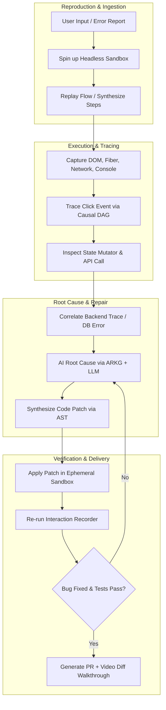
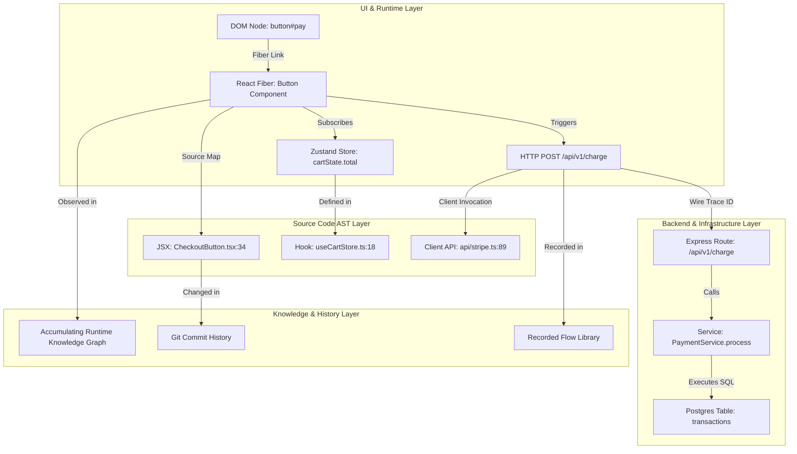

# DevFlow: Unified Runtime-to-Source Intelligence Platform
### *Grand Vision, Architecture, Strategic Moat, and the Largest Possible Opportunity*

---

## 1. Executive Summary & Core Thesis

Most modern AI coding assistants (Copilot, Cursor, Claude Code, Devin) operate as **Static Code Manipulators with Terminal Access**. They inspect codebases, execute shell commands, and read static Abstract Syntax Trees (AST). However, they are fundamentally **blind to runtime reality**. They cannot see the dynamic cascade of state transitions, user interactions, network requests, render lifecycles, and database side-effects in a live environment.

```
       TRADITIONAL AI CODING TOOLS                     DEVFLOW CORE MOAT
┌──────────────────────────────────────┐     ┌──────────────────────────────────────┐
│  Static Codebase + LLM + Terminal    │     │      LIVE RUNTIME EXECUTION FABRIC   │
│  • Guesses runtime state             │     │  (DOM + Fiber + State + Wire + DB)   │
│  • Reads logs post-facto             │     │                  ↕                   │
│  • Blind to UI/render lifecycle      │     │  UNIFIED RUNTIME-TO-SOURCE GRAPH     │
│  • Trial-and-error reproduction      │     │                  ↕                   │
│                                      │     │ ACCUMULATING APPLICATION INTELLIGENCE│
└──────────────────────────────────────┘     └──────────────────────────────────────┘
```

**DevFlow's Core Moat:** DevFlow bridges the **Running Application ↔ Execution Provenance ↔ Source Code AST**. By capturing runtime state graphs and tying every byte, render, and click directly to exact source lines and backend handlers, DevFlow transforms debugging, onboarding, refactoring, and feature building from guesswork into deterministic, automated reasoning.

### The Strategic Framing Shift

DevFlow is not primarily a debugger. Debugging is where pain is loudest, but it is only one moment in the developer lifecycle. DevFlow's largest opportunity is:

> **DevFlow is the living memory and intelligence layer between your running application and your source code — always on, always understanding, accumulating knowledge across every session, every developer, every deployment.**

This framing changes what to build. A debugger is invoked when something breaks. An intelligence layer is active while building new features, reviewing code, onboarding, optimizing performance, and doing security audits. DevFlow should be ambient — silent until needed, deeply informed when called upon.

---

## 2. Core Architectural Invariants

DevFlow is architected around two foundational design constraints that must never be violated:

```
┌─────────────────────────────────────────────────────────────────────────────┐
│                       CORE ARCHITECTURAL INVARIANTS                         │
├──────────────────────────────────────┬──────────────────────────────────────┤
│ 1. ZERO-APP-DEPENDENCY (STANDALONE)  │ 2. HIGH-DENSITY TOKEN EFFICIENCY     │
│ • 0 npm packages required in the app │ • Lazy on-demand image hydration     │
│ • 0 build configuration changes      │ • JSON Patch (RFC 6902) state deltas │
│ • 100% client-side browser hooks     │ • Hierarchical MCP context pruning   │
│ • Works instantly on any web app     │ • < 500 tokens per bug summary       │
└──────────────────────────────────────┴──────────────────────────────────────┘
```

### Invariant 1: Zero-App-Dependency (100% Standalone)
Developers should never have to modify their source code, install npm dependencies, or adjust Vite/Webpack configurations to use DevFlow.
- **Hook Discovery:** Uses Chrome DevTools hooks (`__REACT_DEVTOOLS_GLOBAL_HOOK__`) and DOM prototype inspection.
- **MAIN-World Injection:** Network (`fetch`, `XHR`) and console proxying occur via extension script injection into the MAIN execution world.
- **Client-Side Source Map Resolution:** Source maps (`.map` files or inline base64) are fetched and parsed directly by the extension runtime without requiring special build plugins.
- **Fallback Chain:** `_debugSource` Fiber field → source map → function constructor name heuristic → component display name + AST search. Every attribution carries a confidence score (HIGH/MEDIUM/LOW) with a specific reason.

### Invariant 2: High-Density Token Efficiency
LLM context windows are expensive and easily polluted by noisy runtime logs. DevFlow maximizes signal-to-token ratio:
- **Hierarchical MCP Protocol:** MCP tools provide compact overview summaries (~300 tokens) with drill-down tools (`get_step_details`, `get_state_diff`) called only when needed.
- **Micro-State Deltas:** Records minimal RFC 6902 JSON Patches (`[{"op":"replace","path":"/total","value":49.99}]`) rather than full 10,000-line Redux/Zustand state trees.
- **Out-of-Band Screenshot Storage:** Images are written to local disk (`~/.devflow/flows/`) and never inlined into LLM context unless explicitly requested by a vision tool.
- **Noise Filtration & Deduplication:** Polls, heartbeats, analytics pings, and repetitive framework re-renders are deduplicated before reaching the AI model.

---

## 3. The Foundational Architecture: Accumulating Runtime Knowledge Graph

The single most important architectural primitive in DevFlow is the **Accumulating Runtime Knowledge Graph (ARKG)** — a persistent, versioned, queryable graph of everything DevFlow has ever observed about a specific application.

```
┌─────────────────────────────────────────────────────────────────────────────┐
│              ACCUMULATING RUNTIME KNOWLEDGE GRAPH (ARKG)                    │
├─────────────────────────────────────────────────────────────────────────────┤
│  NODES                          │  EDGES                                    │
│  • React Components             │  • "renders" (component → DOM element)   │
│  • State Store Keys             │  • "subscribes to" (component → state)   │
│  • API Endpoints                │  • "calls" (component → API endpoint)    │
│  • Source Files                 │  • "maps to" (runtime element → file)    │
│  • Git Commits                  │  • "changed in" (component → commit)     │
│  • Named User Flows             │  • "caused by" (effect → trigger event)  │
├─────────────────────────────────────────────────────────────────────────────┤
│  PROPERTIES ON EVERY NODE/EDGE                                              │
│  • timing (p50/p95 render time, API latency)                                │
│  • frequency (how often observed across sessions)                           │
│  • failure rate (% of sessions where this path errored)                    │
│  • last_observed (timestamp of most recent capture)                         │
│  • git_sha (which build this was observed in)                               │
└─────────────────────────────────────────────────────────────────────────────┘
```

**Why this is the deepest moat:** Individual features can be copied. Accumulated runtime knowledge about a *specific application* cannot be. A competitor launching today cannot buy a year of an app's runtime history. The ARKG gets more powerful with every session recorded, every component inspected, every deployment observed. It is the foundation of every intelligent capability described in this document: anomaly detection works because "normal" is known; regression detection works because "before" is recorded; natural language queries work because the graph is the answer index.

Start with SQLite. Design the schema carefully. Build every feature against it from Phase 1 onward.

---

## 4. Evolution of Core Capabilities

```
┌─────────────────────────────────────────────────────────────────────────────┐
│                    CURRENT DEVFLOW CAPABILITIES                             │
│                                                                             │
│   [React Flow Recorder]                  [React Source Locator]             │
│   • Records DOM clicks & inputs          • Maps inspected element to Fiber  │
│   • Captures shallow interaction steps   • Extracts JSX source filename     │
└──────────────────────────────────────┬──────────────────────────────────────┘
                                       │
                                       ▼
┌─────────────────────────────────────────────────────────────────────────────┐
│                     NEXT-GEN DEVFLOW CAPABILITIES                           │
│                                                                             │
│   [Causal Execution Chronicle]          [Omnidirectional Code Intelligence] │
│   • Deterministic Time-Travel Recording  • Full Data-Lineage Inspector      │
│   • Causal DAG: every event has causedBy • DOM ↔ State ↔ Query ↔ API ↔ DB  │
│   • Micro-State Diffs & Render Blames    • "Why did this render?" Engine    │
│   • Counterfactual Branching Replay      • Source → Browser Live Link       │
│   • Network & Web Worker Interception    • Blast-Radius Prediction Engine   │
└──────────────────────────────────────┬──────────────────────────────────────┘
                                       │
                                       ▼
┌─────────────────────────────────────────────────────────────────────────────┐
│                   AMBIENT INTELLIGENCE LAYER (LONG-TERM)                    │
│                                                                             │
│   [Accumulating Runtime Knowledge Graph] [Autonomous AI Agent]              │
│   • Persistent cross-session app memory  • 18-stage closed-loop debugger   │
│   • Temporal diff & anomaly detection    • Self-healing CI/CD bot           │
│   • Team-shared intelligence             • Natural language app navigator   │
└─────────────────────────────────────────────────────────────────────────────┘
```

### 4.1 Execution Chronicle: From Timeline to Causal DAG

The recorder must evolve from "steps with screenshots" to a **complete, causal execution chronicle** — a time-indexed, queryable ledger of everything that happened, with causal links between events.

**Causal Threading:** Every event carries a `causedBy` reference forming a directed acyclic graph:
- User clicked **Add to Cart** → caused `cartState` mutation → caused `CartBadge` re-render → caused `GET /api/cart` fetch → caused `CartDrawer` to mount.

This transforms the recorder from a log into a reasoning substrate. DevFlow can answer: *"What did clicking this button ultimately cause?"* with a complete, traceable answer.

**Core Recorder Capabilities:**
1. **Fiber & Hook State Journaling:**
   - Hooks into React internals (`__REACT_DEVTOOLS_GLOBAL_HOOK__`, `memoizedState`, Fiber nodes).
   - Captures state transitions across Redux, Zustand, Recoil, TanStack Query, and React Context.
   - Records action payloads, previous state, next state, and the component slice that triggered the re-render.
2. **Network & Async Task Association:**
   - Intercepts `window.fetch`, `XMLHttpRequest`, and WebSockets via lightweight runtime instrumentation.
   - Injects correlation IDs (`X-DevFlow-Trace-Id`) linking UI interaction IDs → Network Requests → Server-Side Spans.
3. **Visual & Layout Micro-Diffs:**
   - Records DOM MutationObserver deltas alongside sub-millisecond computed style snapshots.
   - Captures layout shifts (CLS), layout thrashing, and paint timings.
4. **Counterfactual Branching Replay:**
   - Fork the recorded state at any step, inject a different event, and continue replaying in a sandbox.
   - Answers: *"What would have happened if the user had clicked 'Pay Now' instead of 'Save for Later' at step 7?"*

### 4.2 Source Locator: Omnidirectional Code Intelligence

The existing locator is browser → source. The evolution is multidirectional.

**Direction 1: Browser → Source (Existing, Enhanced)**
- Element → component → file + line (enhanced with confidence scoring)
- Props provenance: *where did `price={49.99}` come from?* → follow backwards through prop drilling → store selector → API response → backend handler → SQL query
- State provenance: *why does `isLoading` equal `true`?* → find the last action/mutation that set it and which user event triggered it

**Direction 2: Source → Browser (New — The Bidirectional Live Link)**
- Highlight a JSX line in your IDE → DevFlow highlights every live DOM element that line currently renders in the browser
- Hover over a state store key → DevFlow highlights every component currently subscribed to that key
- Hover over an API call in source → DevFlow shows the last N real network payloads inline
- *Technical path:* VS Code extension sends cursor position → DevFlow local MCP server → maps to component ID → Chrome extension highlights. Achievable with existing APIs.

**Direction 3: Source → Impact Graph (New — Live Blast-Radius Preview)**
- Before committing: *"This change to `useCartStore.ts:42` currently affects 7 rendered components and 3 active API calls"*
- Runs against the *live app*, not just static AST — catches dynamic behavior static tools miss

**Direction 4: Value → Provenance (New — "Why is this value here?")**
- Click any visible value in the browser (a price, a username, an error message)
- DevFlow traces the full provenance chain: DOM text → React prop → component state → store selector → API response field → backend handler → SQL column
- Presented as an interactive, expandable lineage tree

**Direction 5: "Why did this render?" Engine (Enhanced)**
- Compares `prevProps vs nextProps` and `prevState vs nextState` to explain re-renders
- Example: *"Unstable inline callback in `<ProductCard onClick={() => ...}>` invalidated `React.memo`"*
- Auto-suggests the fix (`useCallback` with correct dependencies) with a source link

---

## 5. The Autonomous AI Debugging Loop

When a developer reports: *"The checkout button doesn't work"*, DevFlow executes an 18-stage closed-loop remediation workflow:



### The 18 Stages

| Phase | Stage | Technical Execution Mechanism |
| :--- | :--- | :--- |
| **Observation** | 1. Ingest Issue | Parse natural language, screenshot, or Sentry alert into semantic interaction intent. |
| | 2. Spin Sandbox | Launch containerized browser (Playwright/Chrome CDP) with seeded local storage and mocked/staging APIs. |
| | 3. Reproduce Flow | Execute navigation steps using vision-agent heuristics or session recording playback. |
| **Trace** | 4. Element Match | Locate `<button id="checkout-btn">` using React Fiber tree inspection rather than brittle CSS selectors. |
| | 5. Trace Handler | Extract the exact source line of `onClick` using Babel/SWC AST source maps. |
| | 6. Follow State | Trace `cartState.status` changing from `IDLE` to `PENDING` without triggering `SUCCESS`. |
| | 7. Intercept Wire | Inspect `POST /api/v1/checkout` yielding `422 Unprocessable Entity`. |
| | 8. Backend Trace | Follow OpenTelemetry trace ID into `checkout_controller.ts:42` and `validateStripeToken()`. |
| | 9. Parse Runtime | Capture unhandled promise rejection: `TypeError: Cannot read properties of undefined (reading 'paymentMethodId')`. |
| **Synthesis** | 10. Root Cause | Pinpoint root cause: Frontend passed camelCase `{ paymentMethodId }`, backend expected snake_case `{ payment_method_id }`. |
| | 11. Explanation | Generate clear explanation referencing both frontend and backend source files and the ARKG history. |
| | 12. Solution Plan | Formulate AST transformation plan for API client serializer and TypeScript interface. |
| | 13. Code Patch | Generate minimal unified diff touching `frontend/src/api/checkout.ts` and `types/cart.ts`. |
| **Verification** | 14. Apply Patch | Apply patch in memory/ephemeral development workspace. |
| | 15. Unit/E2E Tests | Run `vitest run checkout.spec.ts` and verify test suite status. |
| | 16. Re-run Flow | Replay recorded browser flow; verify button transitions through loading state to `/order-success`. |
| | 17. Assert Fixed | Verify absence of console errors, HTTP 422s, and check visual regression thresholds. |
| | 18. Deliver Diff | Open Git branch, output explanatory PR description, and attach video recording of before/after execution. |

### Autonomy Taxonomy & UX Entry Points

DevFlow provides five progressive levels of operational autonomy. Each level has a **concrete UX entry point**.

```
┌─────────────────────────────────────────────────────────────────────────────────────┐
│                        DEVFLOW AUTONOMY TAXONOMY                                    │
├──────────┬─────────────────────────────────────────┬────────────────────────────────┤
│ Level 1  │ Read-Only Forensic Analysis             │ Right-click → "Explain this"   │
│ Level 2  │ Interactive Suggestion Mode             │ "Why is this broken?" in panel │
│ Level 3  │ Human-in-the-Loop Patching              │ "Apply fix" button on diff card│
│ Level 4  │ Autonomous Sandbox Verification         │ "Find & fix" in DevFlow popup  │
│ Level 5  │ Self-Healing Ephemeral Dev Environment  │ CI hook / background agent     │
└──────────┴─────────────────────────────────────────┴────────────────────────────────┘
```

---

## 6. The Unified Runtime-to-Source Intelligence Graph

The core technical engine is a **Directed Multi-Layered Hypergraph** backed by the Accumulating Runtime Knowledge Graph:



---

## 7. Ten Novel Capabilities Beyond the Original Scope

These capabilities leverage DevFlow's unique runtime position and do not exist in any current developer tool.

### 7.1 Living Architecture Map
A real-time, always-current graph of the running application's architecture — observed from live execution, not generated from static analysis.

- Which components are currently mounted
- Which state stores they are subscribed to
- Which API endpoints have been called this session
- Which backend services responded and at what latency

The developer asks: *"Show me everything that renders when I click checkout"* and gets an animated graph of component mounts, state mutations, and API calls as they happen in real-time.

### 7.2 Interaction-to-Test Compiler
One recorded interaction → an entire test suite. DevFlow generates:
1. A Playwright E2E test with **Fiber-based selectors** that survive DOM restructuring because they are based on React component identity, not brittle CSS paths
2. A Vitest unit test for the exercised component
3. Network mock fixtures from real intercepted request/response payloads
4. State assertions from before/after store diffs

Selector hierarchy (most to least resilient): aria-label → role+name → data-testid → component name → CSS selector (last resort, flagged as fragile).

### 7.3 Production Time Capsule
Reproduce any production bug locally, exactly.

When a session recording (PostHog, FullStory, LogRocket) captures a production bug:
1. Ingest the session recording and identify the exact DOM event sequence
2. `git checkout` the exact build SHA from that incident timestamp
3. Build and launch the app in a local Docker sandbox
4. Seed with the session's localStorage/cookies (sanitized)
5. Inject production network responses as mocks (from HAR archive)

Result: a locally-running, faithful reproduction of a production bug — without prod database or infrastructure access.

### 7.4 Prop Drilling Eliminator
DevFlow observes which data flows through prop drilling chains at runtime (not just statically) and identifies:
- Props passed 4+ levels deep without transformation
- The same data fetched independently by sibling branches
- Context values that are read-only at every consumption site

It proposes concrete refactors with auto-generated code changes and live blast-radius analysis: *"Move `userId` to UserContext — it's prop-drilled through 6 layers. Here are the 8 affected files."*

### 7.5 Render Performance Autopilot
Automatically detects performance anti-patterns from recorded runtime data and suggests specific fixes:

| Pattern | Detection | Suggested Fix |
|---|---|---|
| Unstable inline callbacks | Compare `onClick` identity across renders | `useCallback` with correct deps |
| Missing `React.memo` | Count unnecessary child re-renders | Wrap in `memo` with custom comparator |
| Large context subscribers | Track which context slice each consumer reads | Split context or use `useMemo` selector |
| `useEffect` dep array mistakes | Detect effects firing every render | Show which dep changed, suggest correction |
| Waterfall fetches | Detect sequential calls that could parallelize | Suggest `Promise.all` or parallel queries |

Each suggestion links to the source line, includes before/after code, and shows the measured performance impact from recorded traces.

### 7.6 Natural Language Application Navigator
*"How does the discount code get applied?"*

DevFlow:
1. Interprets the question as an intent to understand a feature
2. Identifies related components/routes via code embeddings + the ARKG component graph
3. Traces the implementation path: `DiscountInput` → `usePromoCode` → `POST /api/promo/validate` → `PromoController` → `promos` table
4. Navigates the browser to trigger the feature, recording the runtime trace
5. Generates a narrative explanation with source links and a visual flow diagram

This replaces "search the codebase + read 10 files + run the app to understand it" with a single natural language query.

### 7.7 "What Changed?" Incident Timeline
When an incident is detected (error spike, latency regression, user report), DevFlow automatically constructs:

1. **Deployment timeline:** Git tag history for the last 72 hours
2. **Per-deployment change set:** which files changed, which components those files contain
3. **Runtime diff:** compare flow recordings from before/after each deployment
4. **Causal hypothesis:** *"Error rate spiked after the 14:32 deployment that changed `PaymentService.ts`. Most likely root cause: line 87."*

This is causal incident analysis — connecting production anomalies to specific code changes without manual investigation.

### 7.8 Accessibility Autopilot
Continuous dynamic a11y auditing from live DOM observation — not static linting:

- Focus trap correctness during modal open/close
- ARIA attribute consistency with actual element role and state
- Color contrast with actual computed styles (not just static CSS)
- Keyboard navigation completeness

When violations are found: link to the exact JSX line, explain the WCAG criterion, generate a targeted fix. Catches dynamic violations (e.g., a modal that breaks focus on close) that static linters cannot.

### 7.9 Multi-Developer Session Intelligence
When multiple developers on the same team run DevFlow against the same codebase:
- Detect when two developers are debugging the same broken component simultaneously
- Surface: *"Alice found the root cause of this 20 minutes ago — here's her trace"*
- "Known broken flows" become shared team knowledge, not siloed individual recordings
- Preserve institutional knowledge about why components are designed the way they are

This transforms DevFlow from a per-developer tool into a **team intelligence layer**.

### 7.10 Autonomous Regression Watcher
On every PR/commit, DevFlow re-runs recorded "known-good" flows in a headless sandbox and generates **semantic diffs** — not just pass/fail:

*"This flow still passes, but the checkout button now triggers 2 extra re-renders and the API response time increased by 140ms. The extra re-renders correspond to changes in `CartSummary.tsx` in this PR."*

Posts a PR comment with: what worked, what regressed functionally or performatively, and which specific changes likely caused it.

---

## 8. Beyond Debugging: Full Lifecycle Capabilities

DevFlow is not a debugging tool that also does other things. It is a **development intelligence platform** that happens to be most urgently needed during debugging.

1. **Zero-Friction Codebase Onboarding:** Visual click-to-explain architecture narrative for any UI component. New engineers navigate the browser and ask questions; DevFlow traces the implementation.
2. **Predictive Blast-Radius Refactoring:** Before changing a hook or prop signature, see every component, test, and route that the runtime has observed depending on it.
3. **Performance & Core Web Vitals (CWV):** Maps INP delays and LCP render-blocking resources directly to source code lines and suggests specific fixes with measured impact.
4. **Deterministic Test Synthesis:** Converts browser interactions into Playwright/Cypress E2E and Vitest unit tests with real network mock fixtures using Fiber-based resilient selectors.
5. **Continuous Accessibility (A11y):** Validates focus traps, ARIA attributes, and color contrast directly during interactions on the live DOM.
6. **Security Surface Analysis:** Identifies components rendering user-controlled data without sanitization, API calls including credentials in query strings, and localStorage keys containing sensitive values.
7. **Technical Debt Detection:** Uses runtime frequency data to prioritize which dead code is actually dead (never rendered in any recorded session) vs. frequently exercised.
8. **Regression Detection as CI primitive:** Every PR gets a semantic regression report from re-running recorded flows, not just a red/green test result.

---

## 9. Realistic vs. Hard vs. Moonshot Assessment

### Achievable Now (Months 1–6)

| Capability | Why Achievable |
|---|---|
| Natural language → browser action (click, type, navigate) | Playwright + vision models work today |
| Element → component → source file → surrounding code | Chrome Fiber + source maps, partially built |
| Console error → source line → surrounding code | Stack trace parsing + source maps |
| Network request → backend route → controller handler | Static route matching on backend codebase |
| AI explanation of what went wrong | LLM + structured MCP context |
| Diff generation for localized, simple bugs | LLM with AST context |

### Hard (Months 7–12)

| Capability | Why Hard | Mitigation |
|---|---|---|
| Reproducing a bug from a vague description | Ambiguity is fundamental | Vision-guided Playwright + iterative clarification |
| FE/BE type mismatch detection across the stack | Requires both FE and BE source visibility | Opt-in OTel SDK (Tier 2) |
| Validating a fix didn't break anything else | Needs test coverage or visual regression | Record "known-good" flows as baselines |
| Correct multi-file refactors | LLMs hallucinate across large contexts | Constrain to AST transforms + human review gate |

### Moonshot (Year 2+)

| Capability | Why Hard |
|---|---|
| Self-healing production incidents | Requires safe prod change controls and deployment pipelines |
| Complete FE→BE→DB lineage with zero instrumentation | DB query attribution without tracing headers is fundamentally ambiguous |
| True counterfactual execution (VM-level branching) | State space explosion; needs efficient snapshot/restore |

---

## 10. Backend Instrumentation: Three Tiers, Never Break Tier 1

| Tier | Backend Requirement | Capability |
|---|---|---|
| **Tier 1 (Default, Zero effort)** | Nothing | FE-only: request/response correlation, error detection, latency |
| **Tier 2 (One package)** | OTel SDK in backend | Full FE → BE → service span correlation |
| **Tier 3 (Enterprise)** | DevFlow backend agent | Automatic SQL query capture + DB column lineage |

Tier 1 is always the default. Every feature must work usefully without Tier 2. Tier 3 is opt-in enterprise. **Never break Invariant 1 (zero-app-dependency) to chase Tier 3 features.**

---

## 11. Cross-Stack & Framework-Agnostic Extensibility

### What Stays React-Specific (Through Phase 2)

| Capability | Why React-Specific |
|---|---|
| Fiber tree traversal | Fiber is React's internal data structure |
| `__REACT_DEVTOOLS_GLOBAL_HOOK__` integration | React-specific global |
| Hook state inspection (memoizedState linked list) | React implementation detail |
| "Why did this render?" engine | React rendering model |
| React.memo optimization suggestions | React-specific optimization primitive |

### What Is Framework-Agnostic from Day 1

| Capability | Why Agnostic |
|---|---|
| Network interception (`fetch`/`XHR`/`WebSocket`) | DOM APIs, not framework-specific |
| Console + error capture | Browser APIs |
| Source map resolution | JavaScript artifact |
| Screenshot capture | Browser API |
| MCP interface and flow storage format | Infrastructure layer |
| OpenTelemetry integration | Standard protocol |
| Git forensics | Version control |
| Accumulating Runtime Knowledge Graph | Data layer |

### Framework Expansion Sequence

**Year 1:** React (including Next.js App Router, React Server Components)
**Year 2:** Vue 3 (Reactivity Proxy + devtools hook), Svelte 5 (Runes + Signals inspector)
**Year 3:** Angular, Solid.js, server-side languages (via OTel only)

The principle: nail React deeply (70%+ of complex SPA market) then extract the framework-agnostic layer once battle-tested. Premature abstraction produces shallow support everywhere.

```
┌─────────────────────────────────────────────────────────────────────────────┐
│                             DEVFLOW PLATFORM                                │
├─────────────────────────────────────────────────────────────────────────────┤
│  Framework Adapters (Runtime Instrumentation)                               │
│  ┌───────────────┬───────────────┬───────────────┬───────────────────────┐  │
│  │ React / Next  │ Vue / Nuxt    │ Svelte / Kit  │ Node / Go / Python DB │  │
│  │ (Fiber Hooks) │ (Reactivity)  │ (Signals)     │ (OTel Spans + AST)    │  │
│  └───────────────┴───────────────┴───────────────┴───────────────────────┘  │
├─────────────────────────────────────────────────────────────────────────────┤
│  Universal Invariant Layer                                                  │
│  • AST Parser & Rewriter (OXC / SWC / Babel / Tree-sitter)                  │
│  • Runtime-to-Source Graph Engine (Causality & Data Lineage)                │
│  • Accumulating Runtime Knowledge Graph (SQLite → distributed)              │
│  • Reasoning & Remediation Agent (LLM + MCP Orchestration)                  │
└─────────────────────────────────────────────────────────────────────────────┘
```

---

## 12. What NOT to Build (Strategic Distractions)

- ❌ **Full Mobile (React Native) support before Year 3:** Hermes engine and Metro bundler require completely different instrumentation. Dilutes engineering before the web story is complete.
- ❌ **Custom database agents (Tier 3) as a priority:** OTel is the right answer. Custom DB agents introduce installation friction and violate the zero-app-dependency invariant.
- ❌ **Generic AI refactoring (rename, extract function, etc.):** Cursor and Claude Code already own this. DevFlow should only do refactoring where runtime data creates a *unique* advantage.
- ❌ **LLM fine-tuning at current scale:** Better MCP tools + better context packaging beats fine-tuning. The ARKG provides the necessary domain specificity. Revisit in Year 3.
- ⚠️ **Multi-framework support before Phase 3:** Each adapter requires significant engineering investment. Do Vue/Svelte after the React story is fully solid.

---

## 13. Competitive Landscape & Moat Analysis

| Tool | What It Does | What It Cannot See |
|---|---|---|
| GitHub Copilot / Cursor / Claude Code | Static code + terminal | Runtime state, live DOM, render lifecycle |
| React DevTools | Runtime inspection | Source code connection, recording, AI |
| Redux DevTools | Store state visualization | DOM connection, source mapping, AI |
| Sentry / Bugsnag | Production error capture | Source code navigation, AI root cause |
| LogRocket / PostHog | Session recording | Source code, component identity |
| Playwright / Cypress | Test automation | AI reasoning, live debugging |
| Chrome DevTools | Full browser inspection | Persistence, AI, codebase connection |
| Devin / SWE-agent | Autonomous coding | Runtime execution visibility |

**DevFlow's unique position:** The only tool at the intersection of live runtime execution, component-level identity (React Fiber), source code mapping, accumulated application history (ARKG), and AI reasoning (MCP + LLM). No competitor owns all five. The moat deepens every session because the ARKG accumulates.

---

## 14. Prioritization Matrix

| Feature | Dev Value | AI Potential | Tech Difficulty | Differentiation | MVP Effort | Strategic Leverage | Category |
| :--- | :---: | :---: | :---: | :---: | :---: | :---: | :--- |
| **Fiber ↔ Source bidirectional link** | 9.5 | 7 | 5 | 9.5 | 4 | 10 | **Quick Win / Foundation** |
| **"Why did this render?" engine** | 9 | 8 | 5.5 | 9 | 3.5 | 8 | **Quick Win** |
| **Causal threading in recorder** | 9 | 9 | 6 | 9 | 5 | 10 | **Quick Win / Foundation** |
| **Accumulating Runtime Knowledge Graph** | 10 | 10 | 8.5 | 10 | 8 | 10 | **Foundation — Build Early** |
| **"Why is this value here?" provenance** | 9.5 | 9.5 | 7 | 10 | 5.5 | 9 | **Strong MVP** |
| **Interaction-to-Test compiler** | 9 | 8.5 | 6 | 9 | 5 | 7 | **Strong MVP** |
| **Natural language app query** | 9.5 | 10 | 7.5 | 9.5 | 6.5 | 8 | **Strong MVP** |
| **Render performance autopilot** | 8.5 | 8.5 | 7 | 8.5 | 6 | 6 | **High-Impact Medium-Term** |
| **Temporal diff / regression detection** | 9 | 9 | 7.5 | 9.5 | 7 | 9 | **High-Impact Medium-Term** |
| **Living architecture map** | 8.5 | 8 | 7 | 9.5 | 6.5 | 9 | **High-Impact Medium-Term** |
| **Source → browser live link (IDE)** | 9 | 7.5 | 8 | 10 | 7 | 8 | **High-Impact Medium-Term** |
| **Closed-loop AI bug fix agent** | 10 | 10 | 8.5 | 10 | 8 | 7 | **High-Impact Medium-Term** |
| **"What changed?" incident timeline** | 9 | 9 | 8 | 9.5 | 7.5 | 8 | **High-Impact Medium-Term** |
| **Accessibility autopilot** | 8 | 8 | 6.5 | 8.5 | 5.5 | 5 | **High-Impact Medium-Term** |
| **Multi-developer session intelligence** | 8 | 8.5 | 8 | 9.5 | 7.5 | 7 | **Long-Term** |
| **Production Time Capsule** | 8.5 | 9 | 9 | 9.5 | 8.5 | 6 | **Long-Term** |
| **Prop drilling eliminator** | 8 | 8 | 7 | 8.5 | 6.5 | 5 | **Long-Term** |
| **Autonomous regression watcher (CI)** | 9.5 | 9.5 | 8.5 | 9.5 | 8.5 | 7 | **Long-Term** |
| **Counterfactual replay engine** | 9 | 9.5 | 9.5 | 10 | 9 | 7 | **Moonshot** |
| **Self-healing ephemeral environments** | 9 | 9.5 | 9.5 | 9 | 9.5 | 5 | **Moonshot** |

---

## 15. The Ultimate DevFlow Vision: 2–3 Years

> *"DevFlow is the living intelligence layer between your application and your team. It knows your app as well as your best senior engineer does — has been watching it run for months — and can explain anything, debug anything, and improve anything in seconds."*

### The Experience

A developer opens their app. DevFlow is running passively (Chrome extension). As they navigate, it silently observes and updates the ARKG: which components render, which state they read, which APIs they call, how long things take.

They notice the checkout button looks wrong. They right-click → **"Ask DevFlow"**.

They type: *"Why is the checkout button disabled right now?"*

DevFlow instantly answers:
> *"The button is disabled because `cartState.isProcessing` is `true`. This was set at 14:32:47 when `useCheckout.ts:89` dispatched `SET_PROCESSING` in response to a previous checkout attempt. The `POST /api/checkout` from that attempt returned `422: payment_method_required` at 14:32:49, but the error handler on line 91 only resets `isProcessing` on success — it does not reset on 422. This appears to be a bug introduced in commit `abc1234` on Monday by Alex. Here's the fix:"*

A two-line diff appears.

*"Apply it."* → Patch applied to local file.

*"Write a test for this."* → Vitest unit test + Playwright E2E, pre-seeded with the network mock fixture from the actual failing API call.

*"Show me everything this change affects."* → Every component currently affected by `isProcessing` is highlighted live in the browser.

*"Open a PR."* → Git branch created, patch and tests committed, PR description written with a screen recording of before/after, link posted.

**Total time: under 5 minutes. Total manual investigation: zero.**

### Why No Competitor Can Match This

This experience is impossible without all six layers simultaneously:
1. **Runtime state capture** (what is `cartState.isProcessing`? What set it? When?)
2. **Causal threading** (which event caused which state change?)
3. **Source mapping** (which line of which file set it?)
4. **Git forensics** (which commit introduced the behavior?)
5. **Accumulated application history** (what is "normal" for this button? What changed?)
6. **AI synthesis** (turning all of the above into a coherent explanation, fix, and test)

Any competitor needs to replicate all six. None are close.
