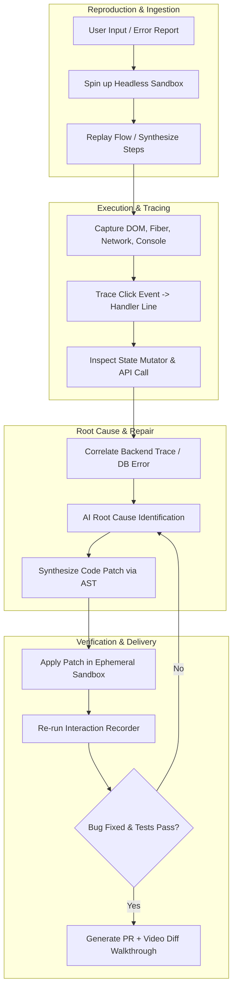
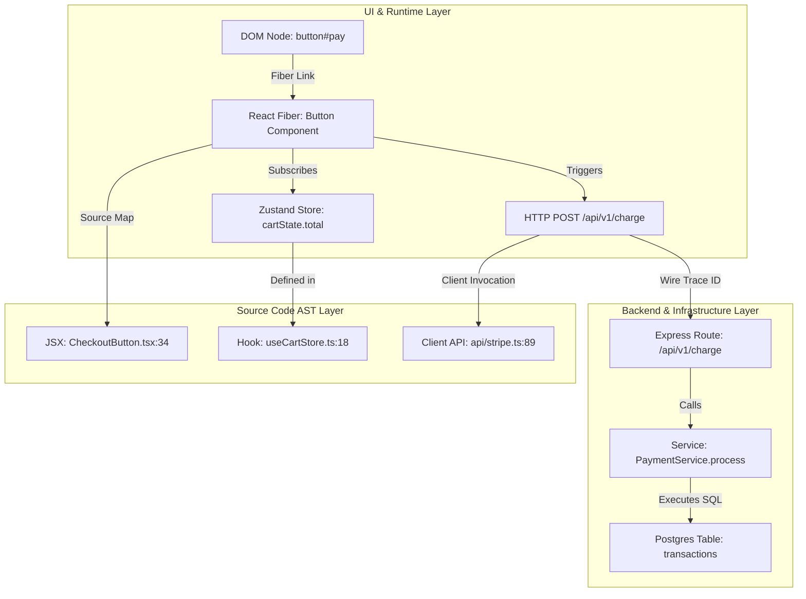

# DevFlow: Unified Runtime-to-Source Intelligence Platform
### *Grand Vision, Architecture, and Strategic Moat*

---

## 1. Executive Summary & Core Thesis

Most modern AI coding assistants (Copilot, Cursor, Claude Code, Devin) operate as **Static Code Manipulators with Terminal Access**. They inspect codebases, execute shell commands, and read static Abstract Syntax Trees (AST). However, they are fundamentally **blind to runtime reality**. They cannot see the dynamic cascade of state transitions, user interactions, network requests, render lifecycles, and database side-effects in a live environment.

```
       TRADITIONAL AI CODING TOOLS                     DEVFLOW CORE MOAT
┌──────────────────────────────────────┐     ┌──────────────────────────────────────┐
│  Static Codebase + LLM + Terminal    │     │      LIVE RUNTIME EXECUTION FABRIC   │
│  • Guesses runtime state             │     │  (DOM + Fiber + State + Wire + DB)   │
│  • Reads logs post-facto             │     │                  ↕                   │
│  • Blind to UI/render lifecycle      │     │  UNIFIED RUNTIME-TO-SOURCE GRAPH     │
│  • Trial-and-error reproduction      │     │                  ↕                   │
│                                      │     │   AUTONOMOUS REASONING & REPAIR      │
└──────────────────────────────────────┘     └──────────────────────────────────────┘
```

**DevFlow’s Core Moat:** DevFlow bridges the **Running Application ↔ Execution Provenance ↔ Source Code AST**. By capturing runtime state graphs and tying every byte, render, and click directly to exact source lines and backend handlers, DevFlow transforms debugging, onboarding, refactoring, and feature building from guesswork into deterministic, automated reasoning.

---

## 2. Core Architectural Invariants

DevFlow is architected around two foundational design constraints:

```
┌─────────────────────────────────────────────────────────────────────────────┐
│                       CORE ARCHITECTURAL INVARIANTS                         │
├──────────────────────────────────────┬──────────────────────────────────────┤
│ 1. ZERO-APP-DEPENDENCY (STANDALONE)  │ 2. HIGH-DENSITY TOKEN EFFICIENCY     │
│ • 0 npm packages required in the app │ • Lazy on-demand image hydration     │
│ • 0 build configuration changes      │ • JSON Patch (RFC 6902) state deltas │
│ • 100% client-side browser hooks     │ • Hierarchical MCP context pruning   │
│ • Works instantly on any web app     │ • < 500 tokens per bug summary       │
└──────────────────────────────────────┴──────────────────────────────────────┘
```

### Invariant 1: Zero-App-Dependency (100% Standalone)
Developers should never have to modify their source code, install npm dependencies, or adjust Vite/Webpack configurations to use DevFlow.
- **Hook Discovery:** Uses Chrome DevTools hooks (`__REACT_DEVTOOLS_GLOBAL_HOOK__`) and DOM prototype inspection.
- **MAIN-World Injection:** Network (`fetch`, `XHR`) and console proxying occur via extension script injection into the MAIN execution world.
- **Client-Side Source Map Resolution:** Source maps (`.map` files or inline base64) are fetched and parsed directly by the extension runtime without requiring special build plugins.

### Invariant 2: High-Density Token Efficiency
LLM context windows are expensive and easily polluted by noisy runtime logs. DevFlow maximizes signal-to-token ratio:
- **Hierarchical MCP Protocol:** MCP tools provide compact overview summaries (~300 tokens) with drill-down tools (`get_step_details`, `get_state_diff`) called only when needed.
- **Micro-State Deltas:** Records minimal RFC 6902 JSON Patches (`[{"op":"replace","path":"/total","value":49.99}]`) rather than full 10,000-line Redux/Zustand state trees.
- **Out-of-Band Screenshot Storage:** Images are written to local disk (`~/.devflow/flows/`) and never inlined into LLM context unless explicitly requested by a vision tool.
- **Noise Filtration & Deduplication:** Polls, heartbeats, analytics pings, and repetitive framework re-renders are deduplicated before reaching the AI model.

---

## 3. Evolution of Core Capabilities

```
┌─────────────────────────────────────────────────────────────────────────────┐
│                    CURRENT DEVFLOW CAPABILITIES                             │
│                                                                             │
│   [React Flow Recorder]                  [React Source Locator]             │
│   • Records DOM clicks & inputs          • Maps inspected element to Fiber  │
│   • Captures shallow interaction steps   • Extracts JSX source filename     │
└──────────────────────────────────────┬──────────────────────────────────────┘
                                       │
                                       ▼
┌─────────────────────────────────────────────────────────────────────────────┐
│                     NEXT-GEN DEVFLOW CAPABILITIES                           │
│                                                                             │
│   [Unified Execution Provenance Fabric]  [Bi-Directional Causal Graph]      │
│   • Deterministic Time-Travel Recording  • Full Data-Lineage Inspector      │
│   • React 19 Fiber + Signals + Hooks     • DOM ↔ State ↔ Query ↔ API ↔ DB   │
│   • Micro-State Diffs & Render Blames    • "Why did this render?" Engine    │
│   • Network & Web Worker Interception    • Blast-Radius Prediction Engine   │
└─────────────────────────────────────────────────────────────────────────────┘
```

### 2.1 Next-Gen Flow Recorder: The Deterministic Time-Travel Engine
1. **Fiber & Hook State Journaling:**
   - Hooks into React internals (`__REACT_DEVTOOLS_GLOBAL_HOOK__`, `memoizedState`, Fiber nodes).
   - Captures state transitions across Redux, Zustand, Recoil, TanStack Query, and React Context.
   - Records action payloads, previous state, next state, and the component slice that triggered the re-render.
2. **Network & Async Task Association:**
   - Intercepts `window.fetch`, `XMLHttpRequest`, and WebSockets via lightweight runtime instrumentation.
   - Injects correlation IDs (`X-DevFlow-Trace-Id`) linking UI interaction IDs $\to$ Network Requests $\to$ Server-Side Spans.
3. **Visual & Layout Micro-Diffs:**
   - Records DOM MutationObserver deltas alongside sub-millisecond computed style snapshots.
   - Captures layout shifts (CLS), layout thrashing, and paint timings.

### 2.2 Next-Gen Source Locator: Bi-Directional Causal Graph
1. **"Why is this value here?" (Data Lineage Engine):**
   - Traces rendered values back through React props $\to$ parent component $\to$ state store $\to$ API response $\to$ backend handler $\to$ database query.
2. **"Why did this re-render?" (Render Blame Engine):**
   - Compares `prevProps vs nextProps` and `prevState vs nextState` to explain re-renders (e.g., *"Unstable inline callback in `<ProductCard onClick={() => ...}>` invalidated `React.memo`"*).
3. **"What will break if I change this?" (Blast-Radius Engine):**
   - Traverses AST dependencies combined with runtime usage traces to identify all components, unit tests, and routes dependent on a modified hook or prop signature.

---

## 3. The Autonomous AI Debugging Loop

When a developer reports: *"The checkout button doesn't work"*, DevFlow executes an 18-stage closed-loop remediation workflow:



### The 18 Stages

| Phase | Stage | Technical Execution Mechanism |
| :--- | :--- | :--- |
| **Observation** | 1. Ingest Issue | Parse natural language, screenshot, or Sentry alert into semantic interaction intent. |
| | 2. Spin Sandbox | Launch containerized browser (Playwright/Chrome CDP) with seeded local storage and mocked/staging APIs. |
| | 3. Reproduce Flow | Execute navigation steps using vision-agent heuristics or session recording playback. |
| **Trace** | 4. Element Match | Locate `<button id="checkout-btn">` using React Fiber tree inspection rather than brittle CSS selectors. |
| | 5. Trace Handler | Extract the exact source line of `onClick` using Babel/SWC AST source maps. |
| | 6. Follow State | Trace `cartState.status` changing from `IDLE` to `PENDING` without triggering `SUCCESS`. |
| | 7. Intercept Wire | Inspect `POST /api/v1/checkout` yielding `422 Unprocessable Entity`. |
| | 8. Backend Trace | Follow OpenTelemetry trace ID into `checkout_controller.ts:42` and `validateStripeToken()`. |
| | 9. Parse Runtime | Capture unhandled promise rejection: `TypeError: Cannot read properties of undefined (reading 'paymentMethodId')`. |
| **Synthesis** | 10. Root Cause | Pinpoint root cause: Frontend passed camelCase `{ paymentMethodId }`, backend expected snake_case `{ payment_method_id }`. |
| | 11. Explanation | Generate clear explanation referencing both frontend and backend source files. |
| | 12. Solution Plan | Formulate AST transformation plan for API client serializer and TypeScript interface. |
| | 13. Code Patch | Generate minimal unified diff touching `frontend/src/api/checkout.ts` and `types/cart.ts`. |
| **Verification** | 14. Apply Patch | Apply patch in memory/ephemeral development workspace. |
| | 15. Unit/E2E Tests | Run `vitest run checkout.spec.ts` and verify test suite status. |
| | 16. Re-run Flow | Replay recorded browser flow; verify button transitions through loading state to `/order-success`. |
| | 17. Assert Fixed | Verify absence of console errors, HTTP 422s, and check visual regression thresholds. |
| | 18. Deliver Diff | Open Git branch, output explanatory PR description, and attach video recording of before/after execution. |

---

## 4. AI Coding Agent & Autonomy Taxonomy

DevFlow provides five progressive levels of operational autonomy:

```
┌─────────────────────────────────────────────────────────────────────────────┐
│                        DEVFLOW AUTONOMY TAXONOMY                            │
├─────────────┬───────────────────────────────────────────────────────────────┤
│ Level 1     │ Read-Only Forensic Analysis (Zero Code Changes)               │
│ Level 2     │ Interactive Suggestion Mode (Diff preview in IDE)             │
│ Level 3     │ Human-in-the-Loop Patching (Applies code on user click)       │
│ Level 4     │ Autonomous Sandbox Verification (Self-testing branch/PR)      │
│ Level 5     │ Self-Healing Ephemeral Dev Environment (Continuous fixer)     │
└─────────────┴───────────────────────────────────────────────────────────────┘
```

---

## 5. The Unified Runtime-to-Source Intelligence Graph

The core technical engine is a **Directed Multi-Layered Hypergraph**:



---

## 6. Beyond Debugging: Full Lifecycle Capabilities

1. **Zero-Friction Codebase Onboarding:** Visual click-to-explain architecture narrative for any UI component.
2. **Predictive Blast-Radius Refactoring:** Predicts breaking changes across routes based on historical runtime traces.
3. **Performance & Core Web Vitals (CWV):** Maps INP delays and LCP render-blocking resources directly to source code lines.
4. **Deterministic Test Synthesis:** Converts browser interactions into Playwright/Cypress E2E and Vitest unit tests with recorded mock fixtures.
5. **Continuous Accessibility (A11y):** Validates focus traps, ARIA attributes, and color contrast directly during interactions.

---

## 7. Cross-Stack & Framework-Agnostic Extensibility

```
┌─────────────────────────────────────────────────────────────────────────────┐
│                             DEVFLOW PLATFORM                                │
├─────────────────────────────────────────────────────────────────────────────┤
│  Framework Adapters (Runtime Instrumentation)                               │
│  ┌───────────────┬───────────────┬───────────────┬───────────────────────┐  │
│  │ React / Next  │ Vue / Nuxt    │ Svelte / Kit  │ Node / Go / Python DB │  │
│  │ (Fiber Hooks) │ (Reactivity)  │ (Signals)     │ (OTel Spans + AST)    │  │
│  └───────────────┴───────────────┴───────────────┴───────────────────────┘  │
├─────────────────────────────────────────────────────────────────────────────┤
│  Universal Invariant Layer                                                  │
│  • AST Parser & Rewriter (OXC / SWC / Babel / Tree-sitter)                  │
│  • Runtime-to-Source Graph Engine (Causality & Data Lineage)                │
│  • Reasoning & Remediation Agent (LLM + MCP Orchestration)                  │
└─────────────────────────────────────────────────────────────────────────────┘
```

---

## 8. Prioritization Matrix

| Feature | Developer Value (1-10) | AI Potential (1-10) | Technical Difficulty (1-10) | Differentiation (1-10) | MVP Effort (1-10) | Priority Classification |
| :--- | :---: | :---: | :---: | :---: | :---: | :--- |
| **Fiber ↔ AST Data-Lineage Inspector** | 9.5 | 8.0 | 6.5 | 9.5 | 4.0 | **Quick Win / Core MVP** |
| **"Why did this render?" Engine** | 9.0 | 7.5 | 5.5 | 9.0 | 3.5 | **Quick Win** |
| **Natural Language UI Query ("Why disabled?")**| 9.5 | 9.5 | 6.5 | 9.5 | 5.0 | **Strong MVP Feature** |
| **Autonomous Replay & Bug-Fix Agent** | 10.0 | 10.0 | 8.5 | 10.0 | 7.5 | **High-Impact Medium-Term**|
| **Multi-Format Bug Reproduction (Video/Logs)**| 8.5 | 9.0 | 8.0 | 9.0 | 7.0 | **High-Impact Medium-Term**|
| **Production-to-Local Sandbox Forensics** | 8.5 | 8.5 | 9.0 | 9.5 | 8.5 | **Long-Term Moonshot** |
| **Self-Healing Ephemeral Dev Environments** | 9.0 | 9.5 | 9.5 | 9.0 | 9.0 | **Long-Term Moonshot** |
